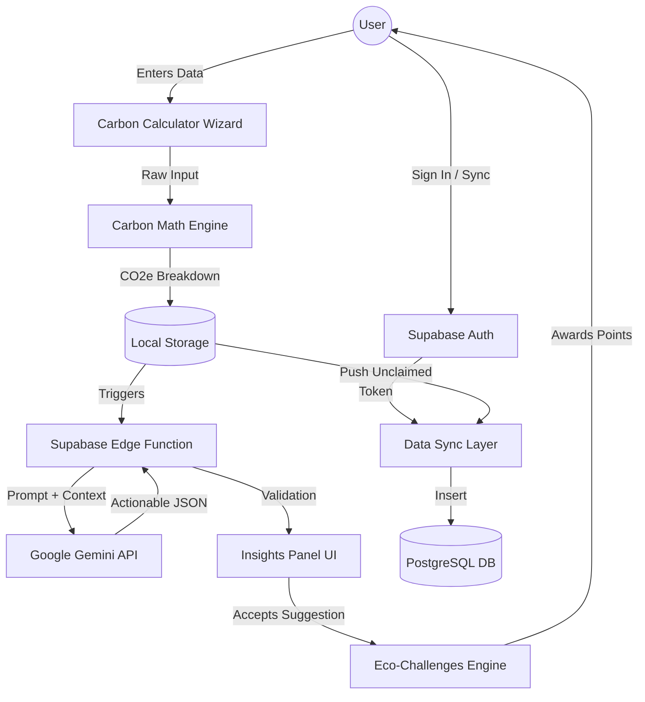

# Architecture — EcoMindX

## Overview
EcoMindX is a **Local-First Serverless Single Page Application (SPA)**. It prioritizes user privacy and immediate responsiveness by storing data locally until the user explicitly decides to synchronize with the cloud.

## Core Components

### 1. Frontend (React + Vite)
- **State Management**: Handled primarily via custom hook orchestration (`useFootprint.ts`) bridging React state and `localStorage`.
- **Component Design**: Modular architecture separating UI shells (`CommunityHub`, `EcoChallenges`, `AccountPanel`) from core logic.
- **Styling**: Vanilla CSS utilizing CSS variables for theme tokens (dark mode, glassmorphism) and responsive grid/flexbox layouts. CSS `content-visibility` used for off-screen rendering optimization.

### 2. Backend (Supabase)
- **Database (PostgreSQL)**: Handles persistent storage of user profiles, historical footprint entries, and community tips.
- **Authentication**: Supabase Auth (Email/Password) integrated with Row Level Security (RLS).
- **Edge Functions (Deno)**: Serverless functions deployed globally to execute sensitive logic (e.g., calling the Gemini API).

### 3. Intelligence Layer (Google Gemini)
- Deployed via Supabase Edge Functions to ensure API keys are never exposed to the client browser.
- Uses `gemini-2.5-flash` model for fast, structured JSON generation of personalized action plans.
- Includes a graceful **Deterministic Rule-Based Fallback** if the AI service is unavailable or rate-limited.

---

## Data Flow Diagram

---

## Security & Accessibility Layers

### Security Architecture
- **Anonymous Tracking**: A `device_id` uuid is generated locally. Users can calculate and track footprints entirely anonymously.
- **RLS Policies**: The `entries` table allows inserts for anonymous users (`user_id is null`) or authenticated users (`user_id = auth.uid()`). Users can only read their own data. Claiming anonymous history transitions ownership safely.
- **Validation & Sanitization**: Strict bounds clamping on the frontend combined with data validation at the edge function layer.
- **Headers**: Vercel `vercel.json` applies strict CSP, X-Frame-Options, and Referrer policies.

### Accessibility (a11y) Architecture
- **Semantic HTML**: Proper use of `<section>`, `role="region"`, and `<fieldset>`.
- **Live Regions**: Screen reader announcements via `aria-live="polite"` for dynamic content like API responses and gamification confetti.
- **Motion Control**: `prefers-reduced-motion` media queries suppress all decorative animations automatically for users with motion sensitivities.
- **Touch Targets**: CSS enforces minimum 44x44px hit areas on mobile devices.
